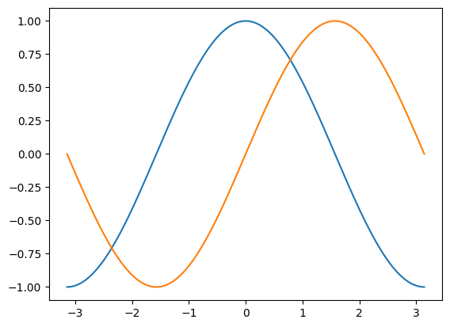
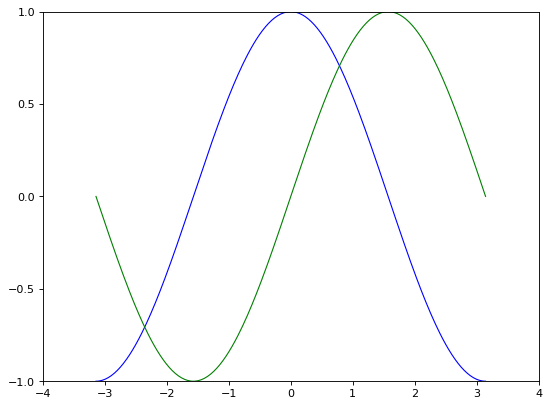

# Plotting

### Interactive Matplotlib for Beginners

This course will guide you through using Matplotlib in interactive mode, perfect for exploring data visualizations dynamically. We'll focus on common use cases to enhance your understanding.

#### 1. Interactive Environments: Jupyter & IPython

Jupyter Notebook and IPython are powerful tools for scientific computing in Python, and they work seamlessly with Matplotlib for interactive plots.

* **IPython Console:**
  *   Enable matplotlib mode with the magic command:

      ```python
      %matplotlib
      ```
* **Jupyter Notebook:**
  *   Insert the following magic command at the beginning of a cell:

      ```python
      %matplotlib inline
      ```

These commands allow plots to update automatically as you execute code cells.

#### 2. Pyplot: A Familiar Interface

Pyplot provides a user-friendly interface for working with Matplotlib's object-oriented structure. Its commands resemble those found in Matlab, making it easy to learn for those with prior experience.

**Example: Plotting Sine and Cosine Functions**

```python
import numpy as np
import matplotlib.pyplot as plt

# Generate data for sine and cosine functions
X = np.linspace(-np.pi, np.pi, 256)  # 256 points from -π to π
C, S = np.cos(X), np.sin(X)

# Plot both functions
plt.plot(X, C)
plt.plot(X, S)

# Display the plot
plt.show()
```

This code generates data points for sine and cosine functions and then creates a plot with both curves.


<figure><figcaption></figcaption></figure>

#### 3. Exploring Plot Customization

Matplotlib offers extensive customization options to tailor plots to your needs. You can control line styles, colors, axes, labels, and more.

**Example: Customizing Line Appearance**

```python
import numpy as np
import matplotlib.pyplot as plt

# Generate data
X = np.linspace(-np.pi, np.pi, 256)
C, S = np.cos(X), np.sin(X)

# Create a figure with specific size and resolution
plt.figure(figsize=(8, 6), dpi=80)

# Create a subplot (1 row, 1 column, plot at index 1)
plt.subplot(1, 1, 1)

# Plot cosine with blue line, linewidth 1
plt.plot(X, C, color="blue", linewidth=1.0, linestyle="-")

# Plot sine with green line, linewidth 1
plt.plot(X, S, color="green", linewidth=1.0, linestyle="-")

# Set axis limits for better viewing
plt.xlim(-4.0, 4.0)  # X-axis limits from -4 to 4
plt.ylim(-1.0, 1.0)  # Y-axis limits from -1 to 1

# Set x and y ticks for easier interpretation
plt.xticks(np.linspace(-4, 4, 9))
plt.yticks(np.linspace(-1, 1, 5))

# Display the plot
plt.show()
```

This code demonstrates setting figure size, line styles, colors, and axis limits for a more customized plot.

<figure><figcaption></figcaption></figure>

**Exercises:**

1. Modify the code above to change the line width and linestyle (e.g., dashed line) for both cosine and sine functions.
2. Experiment with different colors for the lines.

#### 4. Fine-Tuning the Plot

We can further refine the plot to enhance clarity and informativeness.

**Example: Adjusting Axes, Ticks, and Labels**

### 4. Fine-Tuning the Plot (continued)

**Example: Adjusting Axes, Ticks, and Labels (continued)**

```python
import numpy as np
import matplotlib.pyplot as plt

# Generate data
X = np.linspace(-np.pi, np.pi, 256)
C, S = np.cos(X), np.sin(X)

# Create a wider figure
plt.figure(figsize=(10, 6), dpi=80)

# Plot with thicker lines (2.5)
plt.plot(X, C, color="blue", linewidth=2.5, linestyle="-")
plt.plot(X, S, color="red", linewidth=2.5, linestyle="-")

# Adjust axis limits for better data view
plt.xlim(X.min() * 1.1, X.max() * 1.1)  # Extend limits slightly
plt.ylim(C.min() * 1.1, C.max() * 1.1)

# Set specific tick values for sine and cosine functions
plt.xticks([-np.pi, -np.pi/2, 0, np.pi/2, np.pi],
           [r'$-\pi$', r'$-\pi/2$', r'$0$', r'$+\pi/2$', r'$+\pi$'])
plt.yticks([-1, 0, +1],
           [r'$-1$', r'$0$', r'$+1$'])

# Move spines to the center
ax = plt.gca()  # Get current axis
ax.spines['right'].set_color('none')
ax.spines['top'].set_color('none')
ax.xaxis.set_ticks_position('bottom')
ax.spines['bottom'].set_position(('data', 0))
ax.yaxis.set_ticks_position('left')
ax.spines['left'].set_position(('data', 0))

# Add a legend
plt.legend(loc='upper left')

# Annotate interesting points
t = 2 * np.pi / 3
plt.plot([t, t], [0, np.cos(t)], color='blue', linewidth=2.5, linestyle="--")
plt.scatter([t, ], [np.cos(t), ], 50, color='blue')
plt.annotate(r'$cos(\frac{2\pi}{3} )=-\frac{1} {2} $',
             xy=(t, np.cos(t)), xycoords='data',
             xytext=(-90, -50), textcoords='offset points', fontsize=16,
             arrowprops=dict(arrowstyle="->", connectionstyle="arc3,rad=.2"))
plt.plot([t, t], [0, np.sin(t)], color='red', linewidth=2.5, linestyle="--")
plt.scatter([t, ], [np.sin(t), ], 50, color='red')
plt.annotate(r'$sin(\frac{2\pi}{3} )=\frac{\sqrt{3} }{2} $',
             xy=(t, np.sin(t)), xycoords='data',
             xytext=(+10, +30), textcoords='offset points', fontsize=16,
             arrowprops=dict(arrowstyle="->", connectionstyle="arc3,rad=.2"))

# Adjust tick label appearance
for label in ax.get_xticklabels() + ax.get_yticklabels():
    label.set_fontsize(16)
    label.set_bbox(dict(facecolor='white', edgecolor='None', alpha=0.65))

# Show the plot
plt.show()
```

<figure><figcaption></figcaption></figure>

This code demonstrates how to:

* Set specific tick values and labels using LaTeX for better readability.
* Move spines to the center for a cleaner look.
* Add a legend to identify the plotted lines.
* Annotate interesting points with markers, lines, and text.
* Adjust tick label appearance for better visibility.

**Exercises:**

1. Experiment with different annotation positions and arrow styles.
2. Try using different color schemes for the plot.

#### 5. Additional Tips and Tricks

* **Explore Matplotlib's documentation:** It provides a wealth of information on customization options and advanced features.
* **Use interactive tools:** Matplotlib offers interactive tools like zooming, panning, and data selection.
* **Leverage Matplotlib's object-oriented API:** For complex visualizations, you can directly manipulate plot objects to achieve precise control.

### Demystifying Matplotlib: Shapes, Layouts, Axes, and Ticks

This course guide dives into the fundamental building blocks of Matplotlib visualizations: shapes, layouts, axes, and ticks. We'll explore these concepts with clear explanations and practical examples, helping you craft informative and visually appealing plots.

#### 1. The Big Picture: Figures and Subplots

* **Figure:** Imagine the entire Matplotlib window as a canvas. This canvas, referred to as a "figure," holds all the visual elements of your plot. Each figure has a unique title, typically displayed as "Figure #" (starting from 1).
* **Subplots:** Within a figure, you can organize your plots into a grid-like structure using "subplots." These subplots allow you to showcase multiple visualizations within a single figure.

**Tip:** While Matplotlib offers implicit creation of shapes and axes for quick plots, you can gain more control by explicitly using `figure()`, `subplot()`, and `axes()` functions.

#### 2. Figures: Appearance and Customization

A figure's appearance is defined by various parameters, including:

* **Size:** Control the width and height of the figure window.
* **Title:** Set a descriptive title for your plot.
* **Background color and transparency:** Customize the background aesthetics.
* **Margins and spacing:** Adjust the spacing between elements within the figure.

These parameters can be configured through the `plt.figure()` function or by accessing the figure object's properties.

**Remember:** Default values for these parameters are often specified in Matplotlib's resource file. You'll primarily encounter changes to the figure number, allowing you to distinguish between multiple figures.

#### 3. Subplots: Grid-Based Organization

Subplots are ideal for showcasing multiple related plots within a single figure. To create subplots, you specify the number of rows and columns desired, along with the index of the specific plot you want to position within that grid.

**Note:** For more advanced layout control, consider using the `gridspec` command, which offers greater flexibility in arranging plots within a figure.

#### 4. Axes: Precise Placement

Axes provide a powerful alternative to subplots. Unlike subplots that restrict plot placement to a grid, axes allow you to position plots anywhere within the figure window. This is particularly useful when you want to create more complex visualizations with overlapping elements.

#### 5. Ticks: Enhancing Readability

Well-formatted ticks are crucial for creating publication-quality plots. Matplotlib provides a system for configuring ticks, including:

* **Tick locators:** These determine where ticks appear on the axes.
* **Tick formatters:** These control the visual appearance of the tick labels (e.g., font size, color).

By customizing locators and formatters, you can tailor the tick display to fit your specific needs. Matplotlib offers various built-in locators (like `matplotlib.ticker.Locator`) for different requirements.

#### 6. Exploring Different Plot Types

Now that we've covered the fundamentals, let's delve into various plot types you can create with Matplotlib:

**Line Plots:** These are classic plots that showcase trends or relationships between variables using lines connecting data points.

**Scatter Plots:** Useful for visualizing relationships between two variables, these plots depict data points as markers (circles, squares, etc.) at their corresponding positions on the axes.

**Bar Charts:** Ideal for comparing categories, bar charts represent data points as rectangular bars with heights or lengths proportional to the values being compared.

**Contour Plots:** These visualize the distribution of a value over a two-dimensional space using color gradients.

**Image Plots (imshow):** Display an image within your figure, allowing you to visualize data in a grid-like format.

**Pie Charts:** Represent proportions of a whole using slices of a pie, each sized proportionally to the value it represents.

**Quiver Plots:** Visualize two-dimensional vector fields using arrows, where the arrow length and direction represent the magnitude and direction of the vector, respectively.

**Grids:** Create custom grids within your figure for better organization and visual reference.

**Multi-Panel Plots:** Combine multiple subplots within a single figure to showcase various aspects of your data.

**Polar Plots:** Represent data in a circular coordinate system, often used for directional data.

**3D Plots:** Visualize three-dimensional data using surfaces, lines, or other 3D plotting techniques provided by libraries like `mpl_toolkits.mplot3d`.

**Text Annotations:** Add text elements (labels, titles, annotations) to your plots for improved clarity and interpretation.

#### 7. Experiment and Practice!

The best way to master Matplotlib is through hands-on exploration. Refer to the provided code examples and experiment with modifying them to create your own visualizations.
