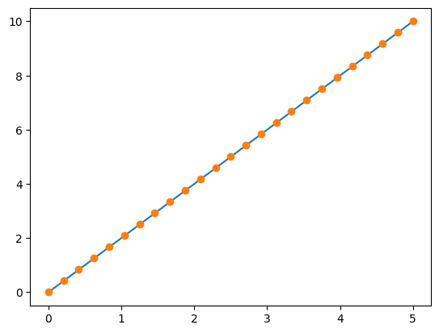
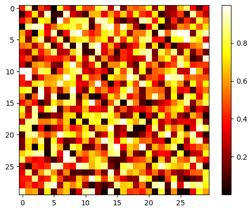

# 04 Basic Data Visualization

With our initial datasets ready, it's time to visualize them to gain insights. Here's how you can get started with visualizing data using Python.

## Setting Up Your Environment

* **Launching Interactive Python**:
  *   Open your terminal and start IPython by typing:

      ```bash
      $ ipython
      ```

      Or, if you have a different setup:

      ```bash
      $ ipython3
      ```
* **Using Jupyter Notebook**:
  *   Alternatively, you can use Jupyter Notebook for a more interactive experience:

      ```bash
      $ jupyter notebook
      ```
* **Enabling Interactive Plots**:
  *   Once inside IPython or Jupyter Notebook, enable interactive plotting:

      ```python
      %matplotlib
      ```
  *   In Jupyter Notebook, to ensure plots appear within the notebook:

      ```python
      %matplotlib inline
      ```

## Visualizing Data with Matplotlib

Matplotlib is a powerful library for creating 2D plots. Here's how to get started:

* **Importing Matplotlib**:
  *   Import the plotting functions from Matplotlib:

      ```python
      import matplotlib.pyplot as plt
      ```
* **Creating Plots**:
  *   To create a line plot, use:

      ```python
      plt.plot(x, y)  # Create a line plot
      plt.show()      # Display the plot (not needed if %matplotlib is used)
      ```
* **Interactive Plotting**:
  *   If interactive plotting is enabled, simply use:

      ```python
      plt.plot(x, y)  # Create a line plot
      ```

## Examples of 1D and 2D Plotting

* **1D Plotting**:
  *   Create a simple line and dot plot:

      ```python
      import numpy as np

      x = np.linspace(0, 5, 25)
      y = np.linspace(0, 10, 25)
      plt.plot(x, y)  # Line plot
      plt.plot(x, y, 'o')  # Dot plot
      ```

<figure><figcaption></figcaption></figure>

*   **2D Arrays (e.g., Images)**:

    * Visualize 2D data, such as images or matrices.


    ```python
    image = np.random.rand(30, 30)
    plt.imshow(image, cmap=plt.cm.hot)

    plt.colorbar()

    ```


<figure><figcaption></figcaption></figure>

## Exercises: Basic Visualization

* **Plot Simple Functions**:
  * Visualize a sine wave over time and a 2-dimensional matrix.
* **Experiment with Color Maps**:
  * Use different color maps, such as the grayscale color map, to visualize 2D data. This can be particularly useful for highlighting different aspects of the data.

By following these steps, you can effectively visualize your data, making it easier to analyze and interpret. Visualization is a crucial part of data analysis, allowing you to see patterns and trends that might not be immediately obvious from raw data alone.
