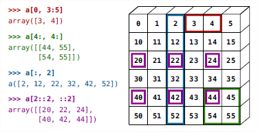

# 05 Accessing and Slicing Arrays

In NumPy, you can access and manipulate elements in an array similarly to how you would with Python lists. Here's a guide on how to do it effectively.

## Accessing Elements

*   **Single Element Access**:

    * You can access elements in a NumPy array using indices, just like with lists.

    ```python
    import numpy as np

    arr = np.arange(10)
    print(arr)  # Output: array([0, 1, 2, 3, 4, 5, 6, 7, 8, 9])
    print(arr[0], arr[3], arr[-1])  # Output: (0, 3, 9)
    ```
*   **Reversing an Array**:

    * Reverse the order of elements using slicing.

    ```python
    print(arr[::-1])  # Output: array([9, 8, 7, 6, 5, 4, 3, 2, 1, 0])
    ```

## Accessing Multidimensional Arrays

*   **Indexing with Tuples**:

    * For arrays with more than one dimension, use tuples of indices.

    ```python
    matrix = np.diag(np.arange(3))
    print(matrix)
    # Output:
    # array([[0, 0, 0],
    #        [0, 1, 0],
    #        [0, 0, 2]])

    print(matrix[1, 1])  # Output: 1
    matrix[2, 1] = 10
    print(matrix)
    # Output:
    # array([[ 0,  0,  0],
    #        [ 0,  1,  0],
    #        [ 0, 10,  2]])
    ```
*   **Row Access**:

    * Access entire rows or columns by specifying one index.

    ```python
    print(matrix[1])  # Output: array([0, 1, 0])
    ```

## Slicing Arrays

*   **Basic Slicing**:

    * Use slicing to access a range of elements.

    ````python
    arr = np.arange(10)
    print(arr[2:9:3])  # Output:
    ```python
    # Output: array([2, 5, 8])
    ````
*   **Slicing with Defaults**:

    * You can omit start, end, or step to use default values (start=0, end=last, step=1).

    ```python
    print(arr[:4])    # Output: array([0, 1, 2, 3])
    print(arr[1:3])   # Output: array([1, 2])
    print(arr[::2])   # Output: array([0, 2, 4, 6, 8])
    print(arr[3:])    # Output: array([3, 4, 5, 6, 7, 8, 9])
    ```

## Modifying Arrays with Slicing

*   **Assigning Values**:

    * You can modify parts of an array using slicing.

    ```python
    arr[5:] = 10
    print(arr)  # Output: array([ 0, 1, 2, 3, 4, 10, 10, 10, 10, 10])

    b = np.arange(5)
    arr[5:] = b[::-1]
    print(arr)  # Output: array([0, 1, 2, 3, 4, 4, 3, 2, 1, 0])
    ```

<figure><figcaption></figcaption></figure>

## Exercises: Indexing and Slicing

* **Experiment with Slicing**:
  * Use slicing to extract odd numbers by counting backwards and even numbers by counting forwards from a `linspace`.
*   **Recreate Segments**:

    * Use the following expression to create a 2D array and practice slicing:

    ```python
    grid = np.arange(6) + np.arange(0, 51, 10)[:, np.newaxis]
    print(grid)
    # Output:
    # array([[ 0,  1,  2,  3,  4,  5],
    #        [10, 11, 12, 13, 14, 15],
    #        [20, 21, 22, 23, 24, 25],
    #        [30, 31, 32, 33, 34, 35],
    #        [40, 41, 42, 43, 44, 45],
    #        [50, 51, 52, 53, 54, 55]])
    ```

## Exercises: Creating Arrays

*   **Construct Specific Arrays**:

    * Create arrays with specific patterns and data types:

    ```python
    # Example 1
    array1 = np.array([[1, 1, 1, 1],
                       [1, 1, 1, 1],
                       [1, 1, 1, 2],
                       [1, 6, 1, 1]])

    # Example 2
    array2 = np.array([[0., 0., 0., 0., 0.],
                       [2., 0., 0., 0., 0.],
                       [0., 3., 0., 0., 0.],
                       [0., 0., 4., 0., 0.],
                       [0., 0., 0., 5., 0.],
                       [0., 0., 0., 0., 6.]])
    ```

## Exercises: Using np.tile for Array Creation

*   **Explore np.tile**:

    * Use the `np.tile` function to create repeating patterns in arrays:

    ```python
    pattern = np.array([[4, 3],
                        [2, 1]])
    tiled_array = np.tile(pattern, (2, 3))
    print(tiled_array)
    # Output:
    # array([[4, 3, 4, 3, 4, 3],
    #        [2, 1, 2, 1, 2, 1],
    #        [4, 3, 4, 3, 4, 3],
    #        [2, 1, 2, 1, 2, 1]])
    ```

By practicing these exercises, you'll become more proficient in manipulating arrays using indexing and slicing, as well as creating complex array structures with NumPy.
