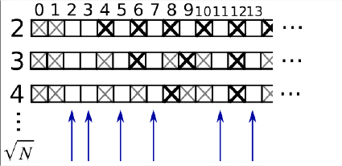

# 06 Copies and views

#### Copies and Views in NumPy

When you perform slicing operations on a NumPy array, you create a view of the original array. This view is simply another way to access the data without duplicating it in memory. To determine if two arrays share the same memory space, you can use the `np.may_share_memory()` function. However, be aware that this function uses heuristics and might occasionally give false positives.

**Modifying Views**

Changes made to a view will affect the original array:

```python
import numpy as np

arr = np.arange(10)
print(arr)  # Output: array([0, 1, 2, 3, 4, 5, 6, 7, 8, 9])

view = arr[::2]
print(view)  # Output: array([0, 2, 4, 6, 8])

print(np.may_share_memory(arr, view))  # Output: True

view[0] = 12
print(view)  # Output: array([12, 2, 4, 6, 8])
print(arr)   # Output: array([12, 1, 2, 3, 4, 5, 6, 7, 8, 9])
```

**Creating Copies**

To create a separate copy of the data, use the `copy()` method. This ensures that modifications to the new array do not affect the original:

```python
arr = np.arange(10)
copy_arr = arr[::2].copy()  # Create a copy
copy_arr[0] = 12

print(arr)  # Output: array([0, 1, 2, 3, 4, 5, 6, 7, 8, 9])
print(np.may_share_memory(arr, copy_arr))  # Output: False
```

This behavior might seem unexpected initially, but it is efficient in terms of memory and processing time.

#### Example: Prime Number Sieve

Let's calculate prime numbers between 0 and 99 using a sieve method:


<figure><figcaption></figcaption></figure>

1.  **Initialize a Boolean Array**:

    * Create a Boolean array `is_prime` of size 100, initially set to `True`.

    ```python
    is_prime = np.ones((100,), dtype=bool)
    ```
2.  **Eliminate Non-Primes**:

    * Set the first two elements (0 and 1) to `False` since they are not prime numbers.

    ```python
    is_prime[:2] = False
    ```
3.  **Sieve Process**:

    * For each integer `j` starting from 2, mark its multiples as `False` (not prime).

    ```python
    N_max = int(np.sqrt(len(is_prime) - 1))
    for j in range(2, N_max + 1):
        is_prime[j*2::j] = False
    ```
4.  **Extract Prime Numbers**:

    * Use `np.nonzero()` to find the indices of `True` values, which correspond to prime numbers.

    ```python
    primes = np.nonzero(is_prime)[0]
    print(primes)
    ```
5.  **Optimization**:

    * Implement the Sieve of Eratosthenes by skipping numbers that are already marked as non-prime and starting the crossing out from `j^2`.

    ```python
    for j in range(2, N_max + 1):
        if is_prime[j]:
            is_prime[j*j::j] = False
    ```
6. **Script Execution**:
   * Save the above code in a script file named `prime_sieve.py` and run it to verify its functionality.

By following these steps, you can efficiently calculate prime numbers using NumPy, leveraging both memory and computational optimizations.
