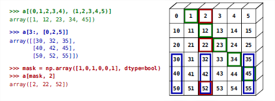

# 07 fantasy indexing

#### Advanced Indexing Techniques in NumPy

NumPy arrays offer powerful indexing capabilities beyond simple slicing. You can use Boolean or integer arrays to index, a technique often referred to as "fancy indexing." This method creates new arrays rather than views, allowing for flexible data manipulation.

**Using Boolean Masks**

Boolean masks allow you to filter and manipulate data based on conditions:

```python
import numpy as np

np.random.seed(42)
arr = np.random.randint(0, 30, 15)
print(arr)  # Example output: array([ 6, 19, 14, 10,  7,  6,  4,  6,  9,  2,  4,  3,  7, 29,  1])

# Create a Boolean mask for elements divisible by 4
mask = (arr % 4 == 0)
print(mask)  # Example output: array([ True, False, False,  True, False,  True,  True,  True, False, False,  True, False, False, False, False])

# Extract elements using the mask
filtered_arr = arr[mask]
print(filtered_arr)  # Example output: array([ 6, 10,  6,  4,  6,  4])

# Modify elements using the mask
arr[arr % 4 == 0] = -1
print(arr)  # Example output: array([-1, 19, 14, -1,  7, -1, -1, -1,  9,  2, -1,  3,  7, 29,  1])
```

**Indexing with Integer Arrays**

Integer array indexing allows you to select specific elements and even repeat indices:

````python
arr = np.arange(0, 100, 10)
print(arr)  # Output: array([ 0, 10, 20, 30, 40, 50, 60, 70, 80, 90])

# Select elements using an integer array
selected_elements = arr[[1, 3, 1, 4, 1]]
print(selected_elements)  # Output: array([10, 30, 10, 40, 10])

```python
# Assign new values using integer array indexing
arr[[8, 6]] = -50
print(arr)  # Output: array([  0,  10,  20,  30,  40,  50, -50,  70, -50,  90])
````

When you use an integer array for indexing, the resulting array will have the same shape as the integer array used for indexing:

```python
arr = np.arange(10)
index_array = np.array([[2, 5], [8, 3]])
print(index_array.shape)  # Output: (2, 2)

# Use the integer array to index
result = arr[index_array]
print(result)  # Output: array([[2, 5], [8, 3]])
```

####

<figure><figcaption></figcaption></figure>

#### Exercises: Advanced Indexing

* **Recreate Complex Indexing**:
  * Try to replicate the advanced indexing techniques shown in the examples above.
* **Smart Indexing for Assignment**:
  * Use advanced indexing to modify parts of an array. For instance, set specific sections of an array to zero using integer or Boolean indexing.

By mastering these advanced indexing techniques, you can efficiently manipulate and analyze data in NumPy arrays, making your data processing tasks more intuitive and powerful.
